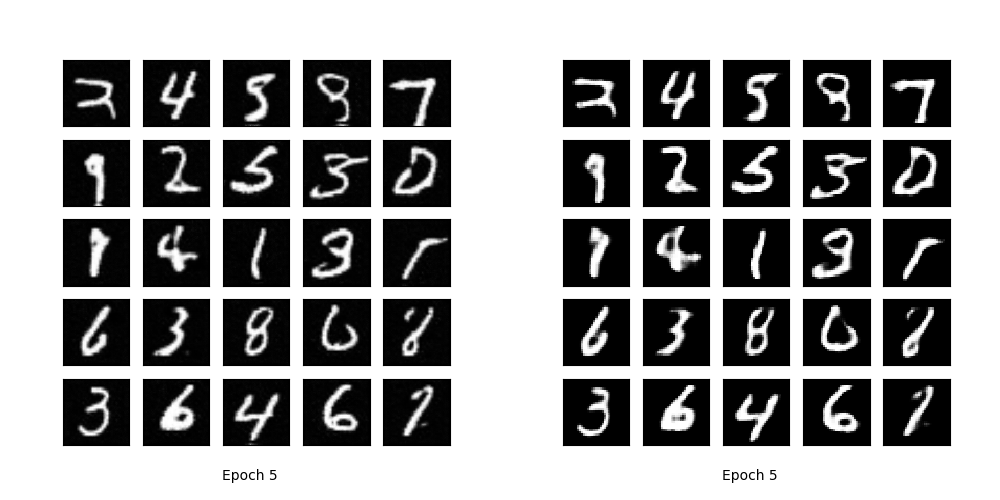
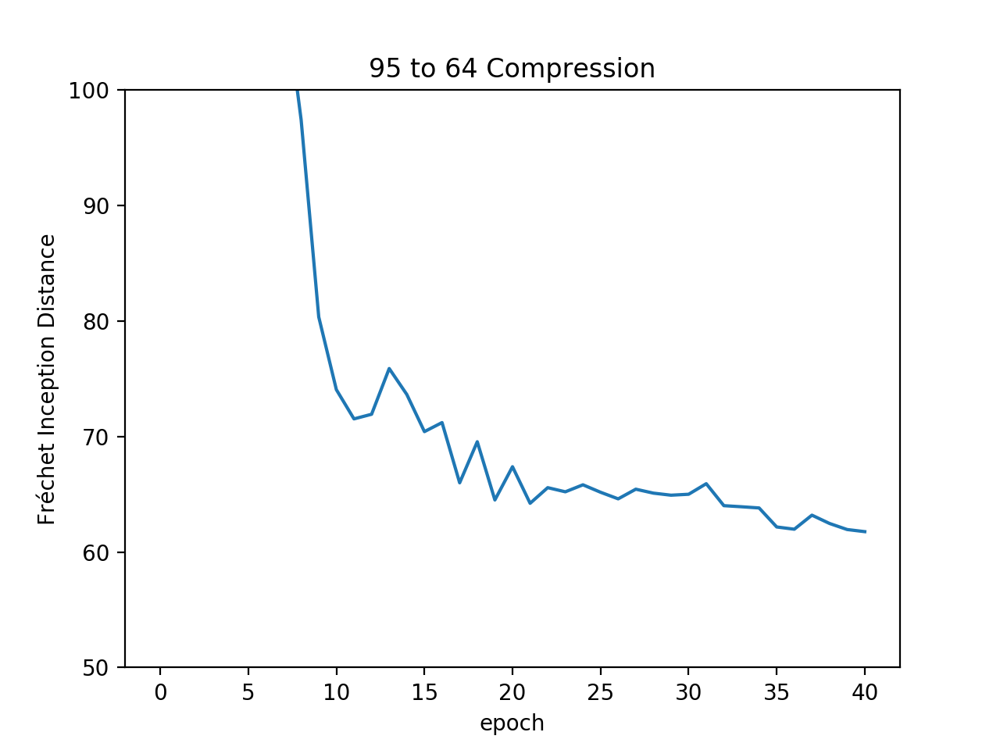

# pytorch-MNIST-CelebA-GAN-DCGAN
Pytorch implementation of Iterative Knowledge Distillation for Improved Generative Model Compression based on Deep Convolutional Generative Adversarial Networks (DCGAN) [1] for MNIST [2] datasets.

* you can download
  - MNIST dataset: http://yann.lecun.com/exdb/mnist/

## Implementation details

* DCGAN

## Resutls

* Original model vs Compressed model

* FID
  * 128-64

  * 128-95

  * 95-64

* FLOP
  * 128-64 - 1.646G
  * 128-95 - 913.792M
  * 95-64 - 420.573M

## Development Environment

* Ubuntu 16.04 LTS
* NVIDIA GTX 1080 ti
* cuda 10.1
* Python 3.7.3
* pytorch 1.2.0
* torchvision 0.1.8
* matplotlib 3.1.0
* imageio 2.5.0
* scipy 1.3.0
* pillow 6.1.0
* scikit-image 0.15.0

## Reference

[1] Radford, Alec, Luke Metz, and Soumith Chintala. "Unsupervised representation learning with deep convolutional generative adversarial networks." arXiv preprint arXiv:1511.06434 (2015).

(Full paper: https://arxiv.org/pdf/1511.06434.pdf)

[2] Y. LeCun, L. Bottou, Y. Bengio, and P. Haffner. "Gradient-based learning applied to document recognition." Proceedings of the IEEE, 86(11):2278-2324, November 1998.

